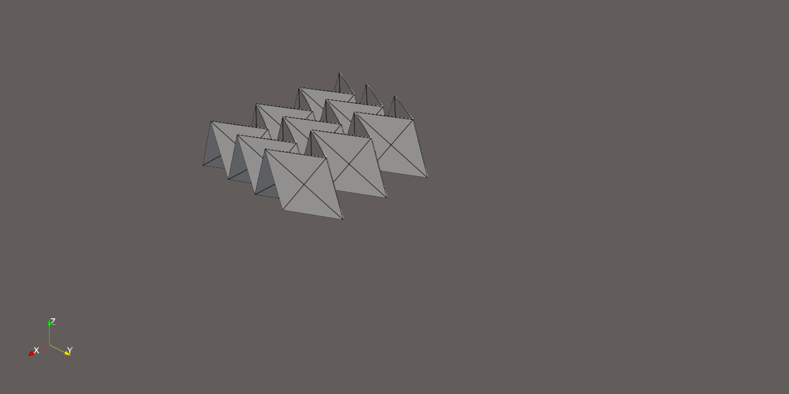

# Dynamical-simulation-of-origami-based-elastic-structures-using-discrete-models

The code from the paper: Maksim Sviridenko and Igor E. Berinskii. "Dynamical simulation of origami-based elastic structures using discrete models." Smart Materials and Structures (2026). The code presents a package for explicit dynamic simulations for the origami structures using a bar-and-hinge approach. The code is featured with the implementation of constraint dynamics, including SHAKE and RATTLE, and provides three examples for popular origami patterns like Z-fold, Miura, and Kresling.

[](docs/videos/S1.mp4)

## Associated Publication

If you use this software, please cite:

Maksim Sviridenko and Igor E Berinskii,
"Dynamical simulation of origami-based elastic structures using discrete models,"
Smart Materials and Structures, 2026.

DOI: 10.1088/1361-665X/ae7f56

## Features

- Bar-and-hinge formulation for origami structures
- Elastic dynamics with extensible bars
- Constraint-based dynamics using modified SHAKE
- Constraint-based dynamics using modified RATTLE

## Installation

Clone the repository:

```bash
git clone https://github.com/MSMS-LAB/ORYGDYN.git
cd ORYGDYN
```

Install the required dependencies:

```bash
pip install -r requirements.txt
```

The code has been tested with Python 3.11.

## Quick Start

The presented parameters for different origami structures are valid for the section "*4.1 Kinematic Analysis*" of the corresponding article. 

### Miura Pattern
```bash
python examples/Miura_Pattern.py \
--links-type extendable \
--T 0.03 \
--zeta 0.01 \
--dt-safety-factor 0.5 \
--desired-frames 100 \
--material-name plastic \
--materials-file ./src/materials.yaml \
--force-vector 0 1 0 \
--force-magnitude 20 \
--load-factor \
--plotting \
--a 0.01 \
--b 0.01 \
--gamma 1.26 \
--theta 1.4 \
--nx 3 \
--ny 3 \
--thickness 0.0002
```
The recommended value of `--dt-safety-factor` is 2.0 for `--links-type` `shake` and 5.0 for `--links-type` `rattle`.

### Z-Fold Pattern
```bash
python examples/Z_Fold_Pattern.py \
--links-type extendable \
--T 0.5 \
--zeta 0.01 \
--dt-safety-factor 0.5 \
--desired-frames 1000 \
--material-name plastic \
--materials-file ./src/materials.yaml \
--force-vector 0 1 0 \
--force-magnitude 20 \
--load-factor \
--plotting \
--a 0.025 \
--b 0.01 \
--theta 0.087 \
--nx 16 \
--ny 1 \
--thickness 0.0005
```
The recommended value of `--dt-safety-factor` is 2.0 for `--links-type` `shake` and 5.0 for `--links-type` `rattle`.

### Kresling Pattern
```bash
python examples/Kresling_Pattern.py \
--links-type extendable \
--T 0.02 \
--zeta 0.01 \
--dt-safety-factor 0.2 \
--desired-frames 300 \
--material-name plastic \
--materials-file ./src/materials.yaml \
--force-vector 0 0 -1 \
--force-magnitude 300 \
--load-factor \
--plotting \
--nz 4 \
--a 0.0065 \
--edges 6 \
--height-ratio 1.2 \
--thickness 0.0002
```
The recommended value of `--dt-safety-factor` is 2.0 for `--links-type` `shake` and `rattle`.